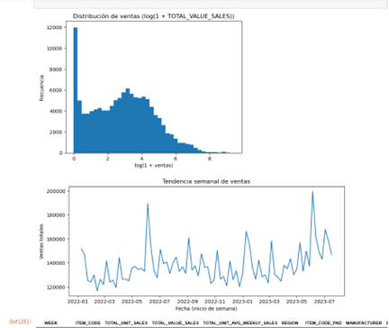
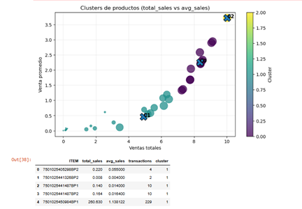

# Retail Sales Data Analysis

## Objetivo del proyecto

El objetivo de este proyecto es analizar el comportamiento de ventas de productos en el sector retail, identificar patrones de compra y aplicar técnicas de análisis de datos y machine learning para segmentar productos y analizar tendencias de ventas.

Este proyecto forma parte de mi formación en Ciencia de Datos, donde se integran herramientas de análisis, visualización y modelado de datos para generar información útil para la toma de decisiones.

---

## Dataset

El análisis se realizó utilizando un conjunto de datos de ventas que contiene información como:

- ventas totales
- número de transacciones
- promedio de ventas
- región
- fabricante
- código de producto
- fechas de venta

Los datos fueron procesados y preparados para su análisis utilizando Python.

---

## Qué se analizó

Durante el proyecto se realizaron varios análisis para comprender el comportamiento de las ventas:

- distribución de ventas de productos
- comportamiento temporal de las ventas
- tendencias semanales
- segmentación de productos según su desempeño en ventas

### Distribución de ventas

Se aplicó una transformación logarítmica para analizar mejor la distribución de los datos de ventas.

---

### Tendencia de ventas

Se analizó la evolución de las ventas a lo largo del tiempo para identificar patrones y variaciones semanales.

---

### Clustering de productos

Se utilizó un modelo de clustering para identificar grupos de productos con comportamientos de ventas similares.

---

## Técnicas utilizadas

Durante el proyecto se aplicaron diferentes técnicas de análisis de datos:

### Análisis exploratorio de datos (EDA)

- análisis de distribución
- análisis temporal
- visualización de patrones

### Limpieza y preparación de datos

- transformación de variables
- manejo de distribución sesgada

### Machine Learning

Se utilizó **K-Means Clustering** para segmentar productos según su comportamiento de ventas.

---

## Herramientas y tecnologías

---

## Resultados principales

El análisis permitió:

- identificar patrones de ventas en el tiempo
- segmentar productos según su desempeño
- comprender la distribución de ventas en el dataset
- generar visualizaciones útiles para análisis de negocio

Estos resultados pueden utilizarse para apoyar decisiones relacionadas con inventario, marketing o estrategias comerciales.

---

## Qué aprendí

Este proyecto me permitió aplicar un flujo completo de análisis de datos:

- exploración y limpieza de datos
- análisis estadístico
- visualización de datos
- aplicación de modelos de machine learning
- interpretación de resultados

También reforcé el uso de herramientas como **Python, SQL y Power BI** para análisis de datos aplicado a problemas de negocio.

---

## Archivos del proyecto

